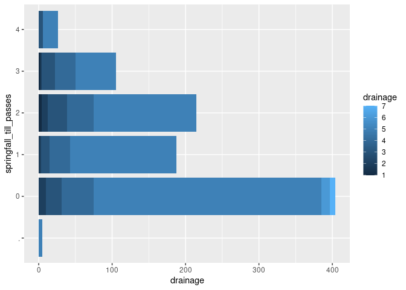
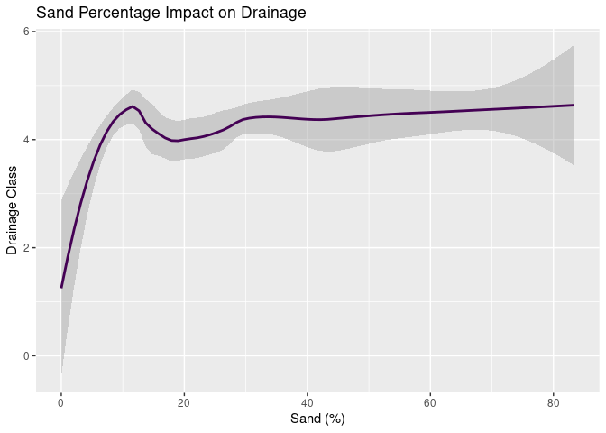

Project memo
================
Aronah, Clastel, Blake

Summary: Agricultural practices have been discovered to have adverse
effects on soil health and the quality of soils. Since the Industrial
Revolution, humans have developed practices that may harm soil health
and its essential properties. This project was based on a data set of
soil qualities and properties from 218 different farmlands across
Wisconsin and Minnesota from 2015 to 2017. The dataset explores how soil
properties (e.g., texture, pH, and drainage class), as well as soil
organic matter (SOM), are affected by specific farming and agricultural
practices. Practices used among these farms include rotation of crops,
tillage type and frequency (e.g., no-till, conventional till), use of
cover crops, and manure application (e.g., timing, type, and frequency).
We found that certain livestock have more effects on soil qualities like
pH and that the amount of soil tilling can heavily impact the health and
presence of water drainage in soil.

Methods: The soil samples collected were obtained from six distinct
regions of farmland and watersheds across the East of Wisconsin and
Southeast of Minnesota. Soil samples were taken from areas identified by
the farmer as areas with average crop yield and then frozen and stored
(on the same day as the sample was collected) for 30 days to kill any
microbes and stagnate organic matter mineralization. Samples were then
thawed and analyzed for soil properties under the USDA NRCS Web Soil48
at the University of Wisconsin Soil and Forage Analysis. Laboratory
(Marshfield, Wisconsin). Soil organic matter (SOM), total organic carbon
(TOC), total Nitrogen (TN), and total Carbon (TC) were determined
through different tests, including heating and combustion as well as
effervescence. Analysis of variance (ANOVA) tests were done to determine
the individual effects of SOM, TOC, and TN. These samples were
collected, tested, and analyzed to discover how agricultural practices
and preexisting soil compositions influence SOM.

Analysis: For our analysis we created a violin plot depicting variation
in pH of soil in relation to the type of manure used on the soil. In
addition the chart has a variable depicting the state of the manure
whether it’s solid, liquid, etc. In this chart it shows the variance of
each manure type’s impact on pH. The reason for using a violin plot was
to see the density of the variation of ph.

For the second part of our analysis, we created a stacked bar plot that
counted the number of fields, the number of seasonal till passes, and
evaluated the correlation with the soil’s drainage class (evaluated on a
level 1-7, 7 retaining the least amount of water.) We wanted to use a
bar plot to visualize percentages and demonstrate the correlation in a
clearly interpretable graph.

Conclusions: In terms of conclusions it’s hard to say whether the manure
is the sole impact on pH so therefore it’s hard to make a final
conclusion, however, within the visualization it’s pretty clear which
are more consistent. In this case, Cows manure was the most consistent
at staying in the ideal pH range for crop growth being between 6.8 and
7.5. More specifically the dairy cows were more consistent than beef
cows due to the different diets.

Tillage is the practice of turning the soil to allow for better airflow
and make it easier for water to permeate the top layers of soil.
However, tilling practices can contribute to soil loss and erosion, can
reduce nutrients, and it disrupts the soil structure (Wallander 2020).
Our data shows that the vast majority of well-drained soils were on
farms with no-till or low-till practices. No-till or low-till practices
allow soil structures to remain intact and avoid compaction, which is
shown to directly correlate with better drainage.

### Load Packages

``` r
library(tidyverse)
library(broom)
library(readr)
library(dplyr)
library(janitor)
library(ggthemes)
library(gapminder)
```

### Load data

``` r
data2 <- read_csv("../data/Data2.csv")
```

    ## Rows: 218 Columns: 35
    ## ── Column specification ────────────────────────────────────────────────────────
    ## Delimiter: ","
    ## chr (22): FieldID, tile, TOC, Date_Of_TOC, TN, CtoN, Rtn, rtnNumber, cvrsSpe...
    ## dbl (13): Region, Sampling Time, Year, Sand, Clay, Drainage, SoilType, pH, O...
    ## 
    ## ℹ Use `spec()` to retrieve the full column specification for this data.
    ## ℹ Specify the column types or set `show_col_types = FALSE` to quiet this message.

### data cleaning Steps for Overall Data

### data cleaning step 1

``` r
Data2_clean <- janitor::clean_names(data2)
glimpse(Data2_clean)
```

    ## Rows: 218
    ## Columns: 35
    ## $ field_id               <chr> "AP1601", "AP1602", "AP1603", "AP1604", "AP1605…
    ## $ region                 <dbl> 1, 1, 1, 1, 1, 1, 1, 1, 1, 1, 1, 1, 1, 1, 1, 1,…
    ## $ sampling_time          <dbl> 1, 1, 1, 1, 1, 1, 1, 1, 1, 1, 1, 1, 1, 1, 1, 1,…
    ## $ year                   <dbl> 2016, 2016, 2016, 2016, 2016, 2016, 2016, 2016,…
    ## $ sand                   <dbl> 30.0, 58.0, 43.8, 29.1, 30.0, 29.1, 26.4, 45.0,…
    ## $ clay                   <dbl> 14.0, 8.0, 16.0, 17.5, 14.0, 17.5, 20.5, 15.0, …
    ## $ drainage               <dbl> 5, 5, 5, 5, 5, 5, 4, 3, 5, 5, 5, 5, 5, 6, 5, 5,…
    ## $ soil_type              <dbl> 5, 3, 3, 5, 5, 5, 3, 5, 3, 5, 5, 1, 3, 4, 5, 5,…
    ## $ p_h                    <dbl> 7.63, 6.83, 7.57, 7.67, 7.50, 7.13, 7.70, 7.20,…
    ## $ tile                   <chr> "1", "0", "0", "0", "0", "0", "0", "0", "0", "0…
    ## $ om                     <dbl> 2.83, 2.83, 2.97, 2.30, 2.43, 2.43, 3.67, 4.53,…
    ## $ toc                    <chr> "2.166", "1.932", "2.542", "3.021", "1.738", "1…
    ## $ date_of_toc            <chr> "10/12/17", "10/12/17", "10/12/17", "10/2/18", …
    ## $ tn                     <chr> "0.192", "0.171", "0.167", "0.176", "0.104", "0…
    ## $ cto_n                  <chr> "11.28125", "11.29824561", "15.22155689", "17.1…
    ## $ rtn                    <chr> "CC", "CGbW", "CGbW", "CC", "CC", "WCWCCW", "CC…
    ## $ rtn_number             <chr> "1", "3", "3", "1", "1", "3", "1", "4", "4", "4…
    ## $ prev_crop              <dbl> 0, 4, 4, 1, 1, 0, 0, 3, 0, 3, 3, 0, 4, 3, 3, 0,…
    ## $ ncredit_lb_ac          <dbl> 0, 0, 0, 0, 0, 0, 0, 90, 0, 90, 90, 0, 0, 90, 9…
    ## $ ncredit_kg_ha          <dbl> 0, 0, 0, 0, 0, 0, 0, 101, 0, 101, 101, 0, 0, 10…
    ## $ cvr_prior_yr           <dbl> 0, 1, 0, 0, 0, 0, 0, 0, 1, 0, 0, 0, 0, 0, 1, 0,…
    ## $ cvrs_species_lg_tm     <chr> "none", "tillage radish", "tillage radish", "no…
    ## $ cvrs5yrs               <chr> "0", "1", "1", "0", "0", "2", "0", "0", "1", "0…
    ## $ springfall_till_passes <chr> "3", "2", "2", "2", "2", "0", "3", "3", "1", "4…
    ## $ till_type              <chr> "3", "3", "3", ".", ".", "1", "3", "3", "3", "3…
    ## $ mnr5yrs                <chr> "5", "1", "2", "3", "3", "0", "5", "2", "5", "0…
    ## $ mnr_source             <chr> "dairy", "dairy", "dairy", "dairy", "dairy", "n…
    ## $ mnr_solid              <chr> "L", "L", "L", "L", "L", "none", "L", "L", "L",…
    ## $ mnr_n_lb_ac            <chr> "244", "102", "0", "144", "0", "0", "119", "70"…
    ## $ mnr_n_kg_ha            <chr> "273", "114", "0", "161", "0", "0", "134", "78"…
    ## $ mnr_timing             <chr> "2", "2", "0", "4", "0", "0", "2", "2", "2", "0…
    ## $ fert_n_lb_ac           <chr> "63", "137", "137", "72", "141", "141", "17", "…
    ## $ fert_n_kg_ha           <chr> "70", "154", "154", "81", "158", "158", "19", "…
    ## $ total_n_lb_ac          <chr> "307", "239", "137", "216", "141", "141", "136"…
    ## $ total_n_kg_ha          <chr> "344", "268", "154", "242", "158", "158", "153"…

### Step 2:Recoding dairy/beef cow

``` r
Data2_clean <- Data2_clean |>
  mutate(
    mnr_source = case_when(
      mnr_source == "dairy" ~ "dairy cow",
      mnr_source == "beef" ~ "beef cow",
      TRUE ~ mnr_source
    )
  )
```

### Step 3: reordering/filtering missing factors/titles

``` r
Data2_clean |>
  mutate(mnr_solid = str_to_upper(mnr_solid)) |>
  filter(mnr_source != ".") |>
  filter(mnr_solid != ".") |>
  mutate(mnr_source = fct_relevel(
    mnr_source,
    "none",
    "beef cow",
    "dairy cow",
    "chicken",
    "swine",
    "turkey"
  ))
```

    ## # A tibble: 208 × 35
    ##    field_id region sampling_time  year  sand  clay drainage soil_type   p_h
    ##    <chr>     <dbl>         <dbl> <dbl> <dbl> <dbl>    <dbl>     <dbl> <dbl>
    ##  1 AP1601        1             1  2016  30    14          5         5  7.63
    ##  2 AP1602        1             1  2016  58     8          5         3  6.83
    ##  3 AP1603        1             1  2016  43.8  16          5         3  7.57
    ##  4 AP1604        1             1  2016  29.1  17.5        5         5  7.67
    ##  5 AP1605        1             1  2016  30    14          5         5  7.5 
    ##  6 AP1606        1             1  2016  29.1  17.5        5         5  7.13
    ##  7 AP1607        1             1  2016  26.4  20.5        4         3  7.7 
    ##  8 AP1608        1             1  2016  45    15          3         5  7.2 
    ##  9 AP1701        1             1  2017  58     8          5         3  7.4 
    ## 10 AP1702        1             1  2017  20    31          5         5  7.07
    ## # ℹ 198 more rows
    ## # ℹ 26 more variables: tile <chr>, om <dbl>, toc <chr>, date_of_toc <chr>,
    ## #   tn <chr>, cto_n <chr>, rtn <chr>, rtn_number <chr>, prev_crop <dbl>,
    ## #   ncredit_lb_ac <dbl>, ncredit_kg_ha <dbl>, cvr_prior_yr <dbl>,
    ## #   cvrs_species_lg_tm <chr>, cvrs5yrs <chr>, springfall_till_passes <chr>,
    ## #   till_type <chr>, mnr5yrs <chr>, mnr_source <fct>, mnr_solid <chr>,
    ## #   mnr_n_lb_ac <chr>, mnr_n_kg_ha <chr>, mnr_timing <chr>, …

### Plot 1: pH levels of soil with differnt manure sources

#### Data cleanup steps specific to plot 1

``` r
ggplot(Data2_clean, mapping = aes(x = mnr_source, y = p_h, fill = mnr_solid)) +
  geom_violin() +
  
  scale_fill_manual(
    values = c(
      "S" = "#404688FF",
      "L" = "#21908CFF",
      "B" = "#7AD151FF",
      "NONE" = "#FDE725FF"
    ),
    breaks = c("S", "L", "B", "NONE"),
    labels = c("Solid", "Liquid", "Both", "None")
  ) +
  
  
  
  
  labs(title = "pH levels of soil with different manure sources",
       x = "Manure Type",
       y = "pH",
       fill = "State of Manure") +
  geom_hline(aes(yintercept = 6.8), linetype = "dotted", size = 0.7) +
  geom_hline(aes(yintercept = 7.5), linetype = "dotted", size = 0.7) +
  scale_color_manual(name = "pH",
                     values = c("Unhealthy" = "black", "Healthy" = "black")) +
  geom_text(aes(x = "turkey", y = 7.6), label = "Ideal pH Range")
```

    ## Warning: Using `size` aesthetic for lines was deprecated in ggplot2 3.4.0.
    ## ℹ Please use `linewidth` instead.
    ## This warning is displayed once every 8 hours.
    ## Call `lifecycle::last_lifecycle_warnings()` to see where this warning was
    ## generated.

    ## Warning: Groups with fewer than two datapoints have been dropped.
    ## ℹ Set `drop = FALSE` to consider such groups for position adjustment purposes.

    ## Warning: No shared levels found between `names(values)` of the manual scale and the
    ## data's colour values.


\### Plot 2: Drainage and tilling correlation

``` r
#data cleaning for plot specifically
Data2_clean|> filter( springfall_till_passes != ".") |>
select(c(springfall_till_passes, drainage))|> 
  
#plot
ggplot( mapping = aes(x = drainage, y = springfall_till_passes))+
         geom_violin(fill = "darkgreen")+
  #scale_colour_viridis_d() + 
  labs(
  title = "Drainage and Tilling Correlation", subtitle = "Drainage class is rated on a scale from 1-7, ranging from 'very poorly drained' to  'excessively drained'. Tilling is the act of aerating the soil (typically with heavy machinery) to improve air circulation and water permeation. ", 
  x = "Drainage Class",
  y = "Spring- Fall Till Passes"
  
) 
```


### Plot 3: tillage impact on drainage

``` r
#data cleaning changed variable 
Data2_clean|> filter(springfall_till_passes != ".") |>  mutate(drainage = as.character(drainage)) |> group_by (springfall_till_passes, drainage) |> arrange(drainage)|>
ggplot(aes(fill = drainage, y = springfall_till_passes)) + 
  labs(title = "Tillage impact on drainage", x = "Number of fields", y = "Number of till passes", fill = "Drainage")+

  
  scale_fill_manual(
    values = c(
      "1" = "#440154FF",
      "2" = "#443A83FF",
      "3" = "#3B528BFF",
      "4" = "#2C728EFF",
      "5" = "#24868EFF",
      "6" = "#1F9A8AFF",
      "7" = "#47C16EFF"
    ),
    breaks = c("1", "2", "3", "4", "5", "6", "7"),
    labels = c(
      "Very poorly drained",
      "Poorly drained",
      "Somewhat poorly drained",
      "Moderately well drained",
      "Well drained",
      "Somewhat excessively well drained",
      "Excessively drained"
    )
  ) +
  

  geom_bar(position = "stack")
```


\### Plot 4: bar plot of tilling and drainage

``` r
Data2_clean|> group_by (springfall_till_passes, drainage) |> arrange(drainage)|>
ggplot(aes(fill = drainage, y = springfall_till_passes, x = drainage)) + 
  
    geom_bar(position = "stack", stat = "identity")
```

<!-- --> \### Plot 5:
Sand percentage Impact on Drainage

``` r
Data2_clean|>
  ggplot(aes(x = sand, y = drainage))+
  geom_smooth(color = "#440154FF", span = .5 ) + 
  labs( title = "Sand Percentage Impact on Drainage", x = "Sand (%)", y = "Drainage Class")
```

    ## `geom_smooth()` using method = 'loess' and formula = 'y ~ x'


\### Plot 6: Clay Percentage Impact on Drainage

``` r
Data2_clean|>
  ggplot(aes(x = clay, y = drainage))+
  geom_smooth(color = "#2C728EFF", span = .5) +
labs(title = "Clay Percentage Impact on Drainage", x = "Clay (%)" ,y = "Drainage Class")
```

    ## `geom_smooth()` using method = 'loess' and formula = 'y ~ x'


## 4. Data Ethics Review

The data ethics review section will be introduced in a separate class
and is not part of the original proposal deadline.
